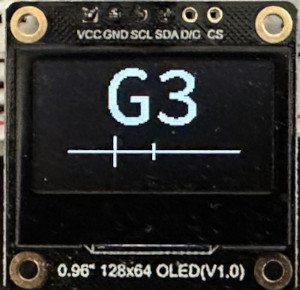

# Description

A microcontroller (STM32) guitar tuner.

TODO embed video demonstration of it. 


# Motivation

I wanted to write a guitar tuner that I would actually want to use, and for me to want 
to use it, it had to be similar in form factor and functionality to the current tuner I use, 
the Korg Pitchclip, which is small, portable (battery powered), and boots into the tuner instantly.

A microcontroller meets all of this criteria, hence this guitar tuner is implemented with 
a microcontroller. This was initally written for the Raspberry Pi Pico microcontroller board, 
then ported to STM32 (particular MCU board mentioned below) for the following reasons.

1. The STM32 MCU here has a FPU whereas the Pico doesn't, and the DSP does a fair amount 
of floating point processing. In particular the low-pass filter stage of the DSP was a 
huge bottleneck on the Pico because of this, not allowing it to sleep and save power, 
and adding delay to when a note reading could be displayed.
2. The STM32 has better power saving options, allowing for less overall current consumption,
beneficial for battery operation.
3. The MCU board here has two adequately separate 3V3 pins, whereas the Pico only has one, 
allowing the mic and display to be on separate power lines so the voltage ripple and noise
introduced by the display doesn't ruin the operation of the mic.


# Assembly

The following explains how to create the guitar tuner: all the parts needed, how to connect 
them together, and any caveats.

## Parts

- WeAct Studio STM32F411CEU6 BlackPill V3.1 (TODO or V3.0?) 25 MHz HSE 

	https://github.com/WeActStudio/WeActStudio.MiniSTM32F4x1
	https://www.aliexpress.com/item/1005001456186625.html
	https://www.dfrobot.com/product-2338.html

- Adafruit Electret Mic Amp MAX4466 https://core-electronics.com.au/electret-microphone-amplifier-max4466-with-adjustable-gain.html
- I2C 128x64 SSD1306 OLED display https://www.dfrobot.com/product-2017.html

	Any 128x64 SSD1306 OLED should work, but I use the DFRobot DFR0650
	in particular, so it is preferred. Note by default the display code 
	writes to I2C slave address 0x3C, but this can be changed in code.

- 3.7V 600 mAh lipo battery TODO?
- SparkFun LiPo Charger/Booster 5V https://www.sparkfun.com/products/14411

TODO fix up names of all parts to be more precise, and hyperlink all
TODO introduce parts using their simple names "STM32 MCU board", "mic", "display", "battery"? or not?

## Power

This section describes how I have gone about powering this project, and
so details a battery configuration that has been tested and known to work. 
In the end battery configuration is up to you, so if you do use your own 
configuration, just ensure to use a clean power supply because a dirty power supply 
(e.g. ST-Link) will introduce noise into the ADC and the program won't work 
as well (if at all).

The current consumption of the program (load), tested when powered
via ST-Link, is mostly ~7 mA with spikes up to 14 mA. TODO mention
current when run off boost (if possible with [2]?)

Choice of battery is a 3.7V 600 mAh lipo (TODO hyperlink). The battery powers
the MCU via 5V boost to its 5V pin instead of its 3.3V pin to take advantage 
of its on-board 3.3V regulator.

Choice of 5V output boost (TODO hyperlink) is because it combines a charging 
circuit, 5V boost, and on/off switch all in one module. The charger is 
so that the battery doesn't have to be detached in order to be recharged. 
The boost takes a 0.9-4.75V input voltage range, which satisfies the 
3-4.2V voltage range of the lipo.

TODO capitalise lipo? (LiPo?)
TODO voltage range of lipo correct? or goes even lower?
TODO spacing between units? be consistent or doesn't matter?

## Connections

Ensure the mic and display use separate 3V3 and ground pins because the 
voltage ripple and noise introduced by the display ruins the operation 
of the mic. Also ensure the ground path back to the battery does not use 
the mic's ground pin, as from testing it introduces noise into the ADC.

TODO confirm the above is still the case with the new sparkfun boost? (should be)

TODO show fritzing of all connections


# DSP

The following lists the DSP steps involved in processing a "frame" of audio samples for a detected note.

1. Apply a band-pass filter, mostly for its low-pass (anti-aliasing) filter part to cut off frequencies 
above the Nyquist frequency and prevent aliasing. To visualise the filter with GNU Octave, run
`make -C core plot-filter-coeffs`.
2. Run FFT to convert samples from time domain to frequency domain.
3. Convert the complex number output of the FFT to magnitudes to get the energy of the spectra.
The following plot depicts the magnitude data after completion of this step for audio samples of
note G3. Notice there are harmonic peaks at integer multiples of the fundamental frequency (the 
fundamental frequency of G3 is 195.998 Hz).


4. Apply a Harmonic Product Spectrum (HPS) to the magnitudes to turn the fundamental frequency peak 
into the maximum peak. This is done because the maximum peak isn't necessarily the fundamental, and may 
be a different harmonic, as is the case in the above plot. After HPS the plot now looks like the 
following, with the fundamental now the maxmimum peak. See the [`test/`](test) dir and its README for 
generating these plots on the test data yourself.


5. Select the frequency bin with the max magnitude as the detected frequency.


# Directory Structure

The `core/` directory holds sources for the core library, and `include/` its
headers/API. The core library implements the non-MCU (core) functionality of
the program, e.g. DSP, so that it can be tested completely separate of the 
MCU. 

The `test/` directory contains sources to build binaries to programmatically
test and visualise the core library. See the [`test/`](test) dir and its README for
more info.

The `mcu/` directory contains the MCU specific sources.


# Dependent Software

**Internal Submodule Libraries**
- [CMSIS-DSP](https://arm-software.github.io/CMSIS-DSP/v1.14.4/index.html) for DSP: filters, FFT, etc.
- [libopencm3](https://libopencm3.org/) for its STM32F4 runtime environment and low-level hardware library

**External**
- [GNU Octave](https://octave.org/) for generating filter coefficients. Needed to build the core library.
- [gnuplot](http://www.gnuplot.info/) for (optionally) generating plots to visualise the DSP. See the 
[`test/`](test) dir and its README for more info.


# Usage

To build and install the guitar tuner program on your ST-Link connected board.

```
cd mcu
make
make flash
```

When powered, shown on the top half of the display is the nearest detected note, 
or a question mark if no sound is being made. On the bottom half of the display 
is a slider with two tics, a smaller one fixed in the middle of the slider marking
the frequency of the nearest detected note, and another bigger one appearing anywhere 
along the slider depicting how far in cents away the detected frequency is away from
the nearest note (frequency increases left to right along the slider). 

For example, in the below image the nearest detected note is G3, and the detected frequency
is lower than and out of tune with the G3 reference. To get it tune, tune up until the big tic
is as close to the centre tic as it can get (see the [Frequency Resolution Limitation](https://github.com/petarturukalo/micro-guitar-tuner/tree/main?tab=readme-ov-file#frequency-resolution) 
section below for why this reads as "as close to the centre tic as it can get").



Note one pixel on the slider is one cent, and there is up to 50 cents either side of the 
centre tic. 


# Limitations

## Frequency Resolution

The FFT frequency bin width is fixed, e.g. here the bin width is ~0.977 Hz (see function
`include/dsp.h:bin_width()` and its implementation for more info), but the distance in frequency
between notes decreases as frequency decreases. Thus the frequency resolution is worse at lower
frequencies, e.g. the jumps of the big tic on the display slider will be bigger and it will
be harder to accurately align it with the centre tic, making it harder to get in tune lower
notes like open E2 on the low E string. This is just a shortcoming of the FFT.

## Higher Notes

See comment at G#4 at `core/note.c:note_freqs`.


# Resources

TODO add blackpill board pinout and schematic. if pinout ends up being linked to in parts section
then don't need that here. but still need stm32-base link for schematic? (put here or in parts section)
TODO test links

- [Music and Computers [Book]](https://musicandcomputersbook.com/): if you'd like to learn more about the theory behind this
- Craig A. Lindley - Digital Audio with Java [Book]: used as supplementary material on digital filters, FFT, cents
- [A. Michael Noll's paper on Harmonic Product Spectrum](http://noll.uscannenberg.org/ScannedPapers/Harmonic%20Sum%20Paper.zip): defines the HPS formula 
- [SSD1306 Datasheet](https://cdn-shop.adafruit.com/datasheets/SSD1306.pdf)
- [STM32F411CE Datasheet](https://www.st.com/resource/en/datasheet/stm32f411ce.pdf)
- [STM32F411CE Reference Manual](https://www.st.com/resource/en/reference_manual/rm0383-stm32f411xce-advanced-armbased-32bit-mcus-stmicroelectronics.pdf)

